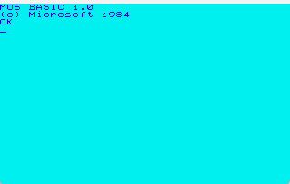
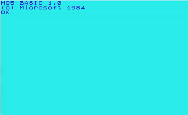
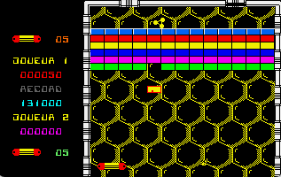
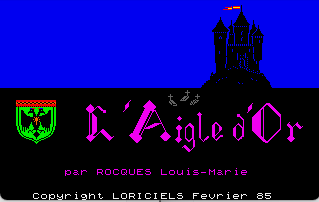
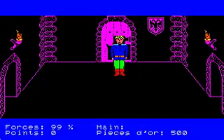

# Maurice

## Description

This is an emulator of Thomson MO5.
This repository is a fork of the MO5 java emulator repository https://github.com/kpouer/marcel which was intially a fork
of the original repository which is available at https://sourceforge.net/projects/marcel/

Of course the licence remains BSD Licence and all the credit goes to the original author.
My goal was to learn Rust and I thought that porting this emulator would be a good way to do so.

## Commands

### Keyboard

F2: Load a tape
F7 : Soft Reset
F8 : Hard Reset

## Loading tapes

It is possible to load tapes by pressing F2 and selecting a .k7 file.
Then usually you have to type "load" and press enter. Then "run" and press enter.

## Showcase

### Boot

### Arkanoid

### Aigle d'or

## Dependencies

This project depends on
- chrono (https://crates.io/crates/chrono)
- cpal (https://crates.io/crates/cpal)
- env_logger (https://crates.io/crates/env_logger)
- log (https://crates.io/crates/log)
- rayon (https://crates.io/crates/rayon)
- rfd (https://crates.io/crates/rfd)
- rust-embed (https://crates.io/crates/rust-embed)
- speedy2d (https://crates.io/crates/speedy2d)
